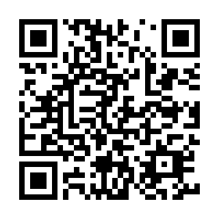
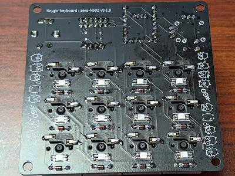
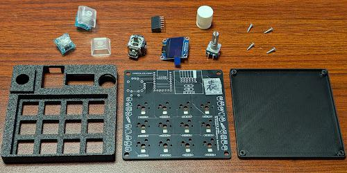

# Build guide

ここでは、はんだ付けや組み立てに関する情報を扱います。  
このページへ QR コードはこちらです。  

English version is below.

* [build guide (English)](./buildguide_EN.md)

## parts list

| No | 品名                            | 個数 | 備考 |
|----|---------------------------------|------|------|
| 1  | 基板                            | 1    | [info](https://github.com/sago35/keyboards?tab=readme-ov-file#zero-kb02)
| 2  | Grove コネクタ                  | 1    |
| 3  | ダイオード                      | 12   | 1N4148
| 4  | ジョイスティック                | 1    | [RKJXV122400R (Alps Alpine)](https://akizukidenshi.com/catalog/g/g115951/)
| 5  | ピンソケット (1x8)              | 2    |
| 6  | ピンソケット (1x7)              | 1    |
| 7  | OLED 液晶                       | 1    | SSD1306 128x64
| 8  | プルアップ抵抗                  | 2    | 3.3K (1K - 10K)
| 9  | L型ピンソケット 2x6             | 1    |
| 10 | キースイッチ                    | 12   |
| 11 | キーキャップ                    | 12   |
| 12 | ソケット                        | 12   | MX socket
| 13 | RP2040 Zero                     | 1    |
| 14 | ロータリーエンコーダー          | 1    |
| 15 | RGB LED                         | 12   | SK6812MINI-E (実装済み)
| 16 | コム足                          | 4    |
| 17 | USB ケーブル (A to C)           | 1    |
| 18 | さらねじ 2.1x10                 | 4    |
| 19 | ケース                          | 1    | [stl](https://github.com/sago35/keyboards/tree/main/zero-kb02/stl)
| 20 | ロータリーエンコーダーノブ      | 1    | [stl](https://github.com/sago35/keyboards/tree/main/zero-kb02/stl)
| 21 | ロータリーエンコーダーノブ (大) | 1    | [stl](https://github.com/sago35/keyboards/tree/main/zero-kb02/stl)
| 22 | ジョイスティックノブ            | 1    | [stl](https://github.com/sago35/keyboards/tree/main/zero-kb02/stl)

## パーツ説明

### 基板

写真左側が表面 (最終的に上側となる) で、右側が裏面 (下側) です。  

### Grove コネクタ

2mm ピッチ 4 ピンのコネクタです。  
ピン配置は 1 ピンから SCL / SDA / 3.3V / GND です。  
I2C 信号である SCL / SDA は OLED と共有になっていることに注意が必要です。  

Grove 接続可能な拡張ボードは多数販売されています。  
zero-kb02 で使えるのは 3.3V I2C で使えるものに限定されます。  

* https://www.switch-science.com/search?type=article%2Cpage%2Cproduct&q=Grove
    * https://www.switch-science.com/search?type=article%2Cpage%2Cproduct&q=Grove*+I2C* ← I2C で絞り込み

### ダイオード

向きがあるので注意です。  
逆につなぐと動作しないので注意してください。  

以下のようなリードベンダーを用いて曲げるときれいに曲げることができます。  

### ジョイスティック

アナログ操作を可能にするためのジョイスティックです。  
傾き及び押し込みを検知できます。  
アルプスアルパイン製でシリーズ全体で世界の据え置きゲーム端末機の 8 割以上のシェア、だそうです。  

### ピンソケット (1x8)

マイコンを抜き差しできるようにするためにソケットを用意しています。

### ピンソケット (1x7)

マイコンを抜き差しできるようにするためにソケットを用意しています。

### OLED 液晶

I2C 接続の OLED (単色) です。  
いわゆるディスプレイです。  
128x64 ピクセルでコントローラーは SSD1306 です。  

### プルアップ抵抗

I2C 用の 3.3kΩ抵抗です。  

### L型ピンソケット 2x6

OLED の下側に配置する L型のピンソケットです。  
上下 2 列の構成です。  

### キースイッチ

押下すると裏面の端子 2 つが接続状態となります。  
多くの製品があります。  

### キーキャップ

キースイッチにかぶせて使います。  
素材や形状、色など、多くの製品があります。  

### ソケット

キースイッチをはんだ付けせずに抜き差しできるようにするためのソケットです。  

### RP2040 Zero

RP2040 というマイコンが搭載されたマイコンボードです。  

### ロータリーエンコーダー

回転および押し込みを検知することができます。  
ボリュームやマウスのホイール等に使用されています。  

### SK6812MINI-E

フルカラーの LED です。  
基板にはんだ付け済みです。  

### ゴム足

ケース底面に貼り付けて滑り止めとして使います。  

### USB ケーブル (A to C)

パソコンとの通信用です。  
環境によっては C to C の場合もあります。  

### さらねじ 2.1x10

ケースおよび作業台で兼用です。  

### ケース

ケースです。  

### ロータリーエンコーダーノブ

ロータリーエンコーダー用のつまみです。  

### ロータリーエンコーダーノブ (大)

ロータリーエンコーダー用のつまみです。  
指で回し続けるような用途はこちらを使うとよい。  

### ジョイスティックノブ

ジョイスティック用のノブです。  

# はんだ付け／組み立て

以降、はんだ付けおよび組み立てについて記載します。  
各項目はそれぞれ表面から作業するものと、裏面から作業するものがあります。  
作業開始時点の向きを以下のバッジで記載しているので参考にしてください。  

##   

表面は完成すると以下のようになります。  

##   

裏面は完成すると以下のようになります。  

## 分解

最初に配布した一式を分解します。  
以下の手順で分解してください。  
今後の工程では作業面を必ず確認しながら進めてください。  

1. ロータリーエンコーダーのノブを取り外す
2. 裏面のねじ x 4 を取り外す
3. 分解するとともに表面に印をつける

以降、表裏がとても大事なので印を見つつ意識してください。  

## 作業台の組み立て

はんだ付けをスムーズに行うために作業台を組み立てます。  
隣の人に底板を持ってもらうとスムーズに組み立てられますので、協力して作業してください。

ケースのボトム側に `はんだサポート` をねじ止めして下さい。  
以降の作業はできるだけ作業台の上で実施してください。  

##  ダイオード x 12

`ダイオード折り曲げ` に沿わせてピンを曲げる。  

ダイオード x 12 を向きに注意しつつ差し込む。  
右の写真のようにシルク印字された三角形のマークの向きとダイオードの黒い側 (矢印部) の向きを合わせてください。  

片側をはんだ付けする。  
位置が大きくずれたら再度熱してはんだを溶かし、位置を整える。  

両側はんだ付け出来たら完成。  

すべてのはんだ付けが終わったら裏返してニッパー等で足をカットしてください。  

##  抵抗 x 2

片側をはんだ付けする。  
抵抗に向きはありません。  
位置が大きくずれたら再度熱してはんだを溶かし、位置を整える。  

両側はんだ付けできたら完成。  
すべてのはんだ付けが終わったら裏返してニッパー等で足をカットしてください。  

##  マイコンのピン

ボードにピンソケット (1x8 x 2 + 1x7 x 1) を置く。  

RP2040 Zero 付属のピンヘッダーを刺してください。  
写真のようにピンが長いほうが下側となり、長いほうをソケットに差し込みます。  
これにより、垂直を出すことができます。  

RP2040 Zero を置いてどれか 1 ピンだけはんだ付けする。  
USBソケットおよび白いボタンがある方が表側になるので、裏側からピンを差し込むよう注意すること。  
はんだ付けできたら位置／向きを確認し、必要があればはんだを溶かして整える。  
しっかり深く刺さっていることを確認すること。  

すべてのピンのはんだ付けが終わったら、ソケットから外しておいてください。  

##  RGB LED (SK6812MINI-E)

RGB LEDは、足の切り欠きとシルクスクリーンの角を合わせた向きにしてください。  

##  スイッチソケット

シルクに合わせてソケットを置く。  

最初に片側はんだ付けする。  
しっかりとランド (基板側) を温めてからはんだを溶かす。  
はんだが溶けたら、籠手を着けたまま指でソケットを下に押し込む。  
ソケットが基板にしっかりとた位置ではんだ付けを完了させる必要あり。  
はんだ付けできたら位置／向きを確認し、必要があればはんだを溶かして整える。  

続いて反対側をはんだ付けする。  

##  ジョイスティック

ここから表面での作業になります。  

ジョイスティックを置いたら矢印の箇所をはんだ付けする。  
はんだ付け出来たらしっかり刺さっているのか確認し、刺さってない場合ははんだを溶かして位置を整える。  

もう一か所はんだ付けする。  

##  ジョイスティック

裏返してすべての箇所をはんだ付けする。  
矢印の 4 箇所ははんだ付けを省略しても良い (はんだ付けしても良い。  

##  Grove コネクター

矢印のピンだけはんだ付けする。  
はんだ付けできたら位置／向きを確認し、必要があればはんだを溶かして整える。  

次に矢印のピンを止めて 2 ピン止まっている状態にする。  
はんだ付けできたら位置／向きを確認し、必要があればはんだを溶かして整える。  

残りのピンをはんだ付けする。  

##  L型ピンソケット 2x6

Grove コネクターと同じで 1 ピンだけはんだ付けする。  
はんだ付けできたら位置／向きを確認し、必要があればはんだを溶かして整える。  

次に矢印のピンを止めて 2 ピン止まっている状態にする。  
はんだ付けできたら位置／向きを確認し、必要があればはんだを溶かして整える。  

残りのピンを裏側からはんだ付けする。  

##  ロータリーエンコーダー

裏表どちらからでも刺さるため、向きに注意してください。  
表面から基板に差し込んでください。  
その際、作業台から外して差し込んだ方が簡単です。  
差し込む向きに注意 (ジョイスティックと同じ側に回転部がくる) してください。  
裏から見て、ちゃんと刺さっていることを確認すること。  

Grove コネクターと同じで 1 ピンだけはんだ付けする。  
はんだ付けできたら位置／向きを確認し、必要があればはんだを溶かして整える。  

2 ピン目をはんだ付けする。  
はんだ付けできたら位置／向きを確認し、必要があればはんだを溶かして整える。  

残りのピンをはんだ付けする。  

##  マイコンのソケット

ソケット (1x8 x 2 + 1x7 x 1) を刺して、マイコンも置く (これにより垂直を出す)。  
必要に応じてマスキングテープ等で止める。  
隣の人に裏から押さえつけてもらってはんだ付けしてもよいです。適時協力して進めてください。  

裏面から ① → ② → ③ の順ではんだ付けする。  
1 ピン毎にちゃんと刺さっているかを確認し、必要に応じてはんだを溶かして位置を整える。  

残りのピンをはんだ付けする。  

##  液晶

基板に液晶を軽く差し込む (奥まで刺さず、ほんの少しだけ差し込む)。  

作業台からおろして、保護フィルムを剥がす。  
写真では保護フィルムをはがしていないですが、この時点ではがしてください。  
ケースを付ける。  
明らかに液晶の位置が悪ければ調整する。  
ケースはしっかり基板にはまるまで押し込む事 (作業台のままではこの作業が出来ない)。  

裏返してはんだ付けする。  
ここでも 1 ピンだけ付けてひっくり返して確認、というのを繰り返す。  
1 ピン毎にちゃんと刺さっているかを確認し、必要に応じてはんだを溶かして位置を整える。  

4 ピンすべてはんだ付け出来たら完成。  

# 以降の組み立て

## キースイッチ

刺さるように刺す。  
ホットスワップ可能となっているので、 Vial の matrix tester 等を立ち上げたまま差し込むと確認が簡単です。  
よくある失敗例としては足がうまく刺さらない、というものです。  
一度抜いて、足をまっすぐに伸ばしてから、再度トライしてください。  

## キーキャップ

刺さるように刺す。  
本当は向き (縦横) があるけど、気にしなくてもよい。  

## ジョイスティックノブ、ロータリーエンコーダーノブ

まっすぐ上から差し込むとよい。  
抜くときに液晶を触らないように注意。  

## マイコン

刺さるように刺す。  
抜くときは、ピンセットなどで少しずつ緩める形で外していく。  

## ねじ

締めすぎないように注意。  
ねじを回すのにほとんど力が必要ない、というぐらいがちょうどよい。  
基板とケースの間に隙間が空く場合、ねじの締めこみで解決するのではなく、手で調整してください。  

# 動作確認

以下のファームウェア (`*.uf2`) を書き込んで確認する。  

## 書き込み方法

1. マイコンとPCをUSB Type-cケーブルで接続する
2. エクスプローラを開き、USBマスストレージとして認識されていることを確認する
3. ダウンロードしたファームウェアをドラックアンドドロップでUSBマスストレージに置く

ロータリーエンコーダーを回してみて RGB LED が光ること、音量が変わることが確認できれば良い。  
それ以外のキーも適宜押してみてLEDが光ることを確認する。  

* https://github.com/sago35/keyboards/releases
    * zero-kb02.uf2

Vial の matrix tester で確認してもよい。  
キーバインドも Vial から確認することができる。  

* https://vial.rocks/

# その他

バッジ作成には以下を使用しました。  

https://michaelcurrin.github.io/badge-generator/
